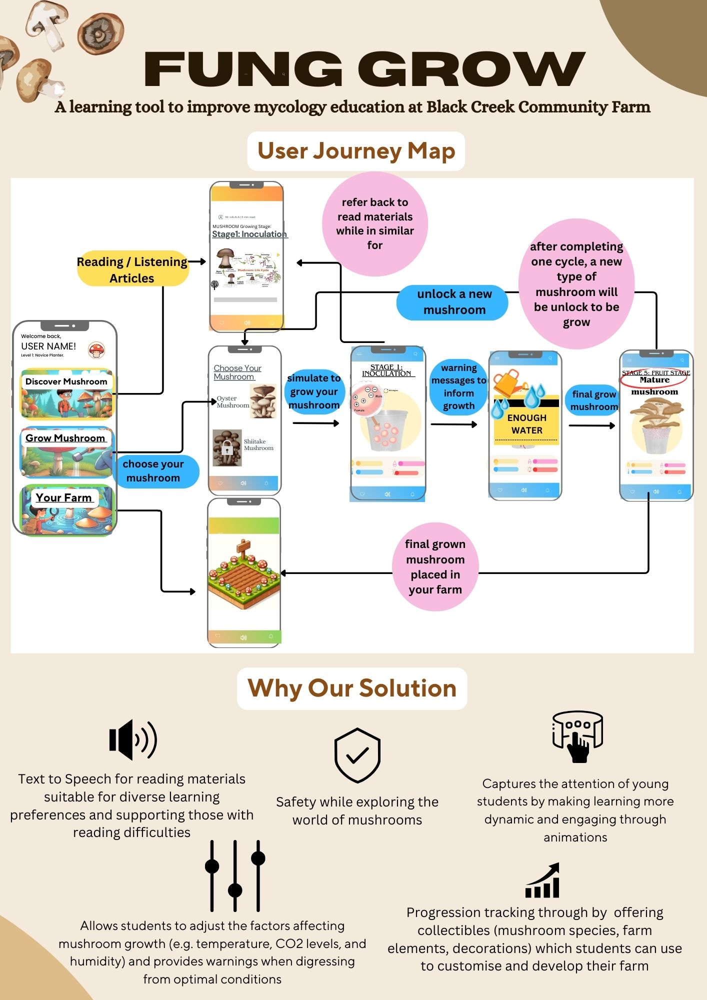

# Readme

This app was created for the praxis 2 course work. The opportunity we’ve chosen is to assist the Black Creek Community Farm in teaching the mushroom growth cycle to middle school students in their Mycology lab. The solution we’ve developed is an app called "fung grow" to improve mycology education at Black Creek. The medium we felt was best suited to this age-range was an app which emphasises “learning by doing.” Students, upon completing their tour at the farm where they would’ve been introduced to the exciting world of mushrooms, will not only reinforce the knowledge they gained but will have a fun way to maintain their interest in the field. 

# Objective of this app 
With this opportunity, we made 4 high-level objectives that the designs should meet so they fulfil the community’s needs. First, our design should evoke a comprehensive understanding of the mushroom growth cycle from students. This aim is to reinforce long-term memory retention of knowledge in the mushroom growth cycle while suiting various learning styles for accessibility. Second, the design should be flexible to evolve through iterations from user feedback, which is crucial for educational designs. Third, our design must prioritise ensuring the safety of students, mitigating any risks involved and teaching safety measures. Lastly, our design must focus on limiting the use of excess resources to align with the community’s constraints and to promote sustainability. 

# Flowchart

Presenting our app's flowchart, this visual guide illustrates the user journey. Initially, the app features three distinct sections, each differentiated by colour: Discover Mushroom, Grow Mushroom, and Your Farm. At the top of the page, users can see their progress levels; as they cultivate more mushrooms, their level increases accordingly.
In the Discover Mushroom section, we offer articles accompanied by images for users to read or listen to. Catering to our middle school audience, we ensure the text within these articles is straightforward and terminology is explained simply for easy understanding. 
The core of the app lies in the Grow Mushroom section. Here, users select from three types of mushrooms available in the community to cultivate. To enhance engagement, we introduce locked mushrooms, which users can unlock by successfully growing mushrooms and levelling up. Once a mushroom is chosen, users simulate its growth by adjusting growing environment conditions, such as temperature etc.. and watering by  clicking the screen. We also provide warning messages to guide users away from actions that may harm the mushrooms (ex, too much water). 
The app utilises transparent plant pots and a magnifying feature, allowing users to observe the substrate and growth stages closely. Corresponding articles explain each growth stage in detail.
Finally, upon successfully cultivating a mature mushroom, it is added to the user's farm, found within the third section of the app. Upon completion, new mushroom types are unlocked, ready for the next cycle of growth and learning.

# Key features

Link to the demo: https://www.canva.com/design/DAGCCxAbDDI/jrm21M_aW7YfTOoVJLTVVA/edit?utm_content=DAGCCxAbDDI&utm_campaign=designshare&utm_medium=link2&utm_source=sharebutton

There are five key features presented in the app. 

Accommodating learning styles: Recognizing the diversity in learning preferences and the abilities of students, our solution delivers information in a way that aligns with the VARK model, which highlights four different preferred learning styles: visual, auditory, reading, and kinesthetic learning. Our design satisfies these four styles through engaging visuals and animations, reading materials, a text-to-speech option accompanied by the instructions from the educators at the farm, and an interactive growing simulation. Additionally, the diverse delivery of information aligns with Mayer and Moreno’s Cognitive Theory of Multimedia Learning, which highlights that long-term memory encoding occurs when information is presented through multiple mediums.

Safety: Safety is a major concern when dealing with biological materials. Our design considers the risks of handling mushrooms and ensures the safety of students while simultaneously allowing them to grow their own mushrooms. This is done by making sure that our design does not increase the CO2 levels in the mycology lab, since the app does not create more CO2. 

Simplifying content: To capture and retain the attention of middle school students, our app integrates animations and simple language that make the learning process not just educational but also easy to comprehend at a middle school level. Animations help visualise processes, while terminology can be easy to understand by instructors on-site as well as our “keywords” function, which simplifies key concepts. 

Feedback: According to the Universal Design of Learning Guidelines, it is important to create an environment that promotes and helps students sustain effort, concentration, and persistence. One of the ways to promote those is by providing feedback and by evoking a sense of achievement. Our design does this in two ways: warnings, and milestones.

Warning system: Firstly, the app allows students to interactively adjust factors affecting mushroom growth, such as temperature, CO2 levels, and humidity. This hands-on approach gives students the opportunity to experiment. If the conditions deviate from optimal conditions, the app provides warnings. This allows students to make mistakes and get feedback on their knowledge, which enhances their understanding and learning experience, according to an article posted by the University of New Brunswick.

Milestones: Secondly, one of the most important features of the app is progress tracking through the building of your own personal farm. According to gamification guidelines, progress tracking allows students to monitor their learning, which can help them self-regulate and better recall information. Progress tracking also serves as a milestone. As students learn and successfully apply their knowledge about mushrooms, they earn collectibles like different mushroom species, farm elements, and decorations. This milestone element motivates students to reinforce their learning.

# Next steps

The app is not fully finisehd yet, requiring us to better incorporate the growth simulation part. Besides, there are some elements we can try to implement for the future:

First, we're exploring the integration of further gamification elements, such as a point-based leaderboard, to cultivate a competitive and engaging environment, motivating students to actively participate and progress in their learning journey. Additionally, we're looking into connecting grow chambers to the app for real-time monitoring, allowing students to observe and control how growth factors influence mushroom growth in real life. Another potential enhancement is providing instructors with customizable templates, enabling them to effortlessly adapt and modify reading materials with interactive elements tailored to their curriculum. Furthermore, we're considering implementing a system to collect student feedback, which could greatly improve the learning environment and material engagement. These potential changes hold promise for enriching the app's features and maximising its impact on student learning.

